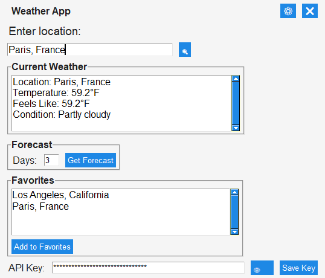

# Python-weather-app
Python weather app made with PySimpleGUI. It displays weather based on your location or a saved location

**Step 1**

Get a free API key from [Weather API](https://www.weatherapi.com/signup.aspx)

**Step 2**

```
pip install -r requirements.txt
```

then...

``python main.py`` to run it

or

run the exe file in the repo (main.exe)

**Step 3**

Click the search button to get the weather in the query, settings in top right to change fahrenheit to celsius, favorites are saved locations, put API Key into bottom query area.

**Demo:**
